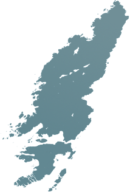

---
---

>
>
>Colonsay, the jewel of the Hebrides, is about 10 miles long and 2 miles wide with 135 friendly inhabitants, and little more than 2 hours from Oban by our modern and very comfortable ferry. Our outstanding natural scenery is rivalled only by the wealth and diversity of our flora and fauna, and our archaeological sites are of international importance.
>
>Local activities include agriculture, oyster-farming, arts, crafts, honey production, a brewery, accommodation for visitors, lobster-fishing, publishing and even a substantial bird sanctuary. The island plays host to a variety of festivals throughout the year celebrating our music, culture, literature and natural assets. Please explore and enjoy our community website - and, when you get an opportunity, come and join us in Colonsay.

### [Accommodation](/accommodation)

We have a wide range of friendly and welcoming places to stay on Colonsay: Self Catering, Bed & Breakfast, a Hostel and Hotel. [Find out more and plan your visit](/accommodation)

### [About Colonsay](/island/about-colonsay)

Colonsay offers great tranquility and packs a wide variety of unspoilt natural beauty into its varied habitats. We are proud of our rich heritage and history and would love to share it with you.

### [Things to do](/things-do/other-things-do)

[Beaches](/things-do/beaches), [wildlife](/things-do/wildlife-watching), [music](/events-festivals/ceòl-cholasa), [food](/events-festivals/festival-spring), and [book](/events-festivals/colonsay-book-festival) festivals, [fishing](/things-do/fishing), [golf](/things-do/golf), [walking tours](/things-do/tours-walks) and [MacPhie bagging](/things-do/macphie-bagging). See just [some of the activities available on Colonsay](/things-do/other-things-do)
    
### [Getting to Colonsay](/getting-colonsay)

By aeroplane or ferry, with a car, bike or on foot from the train: all of the information you need to plan your trip. [Find out more](/getting-colonsay)